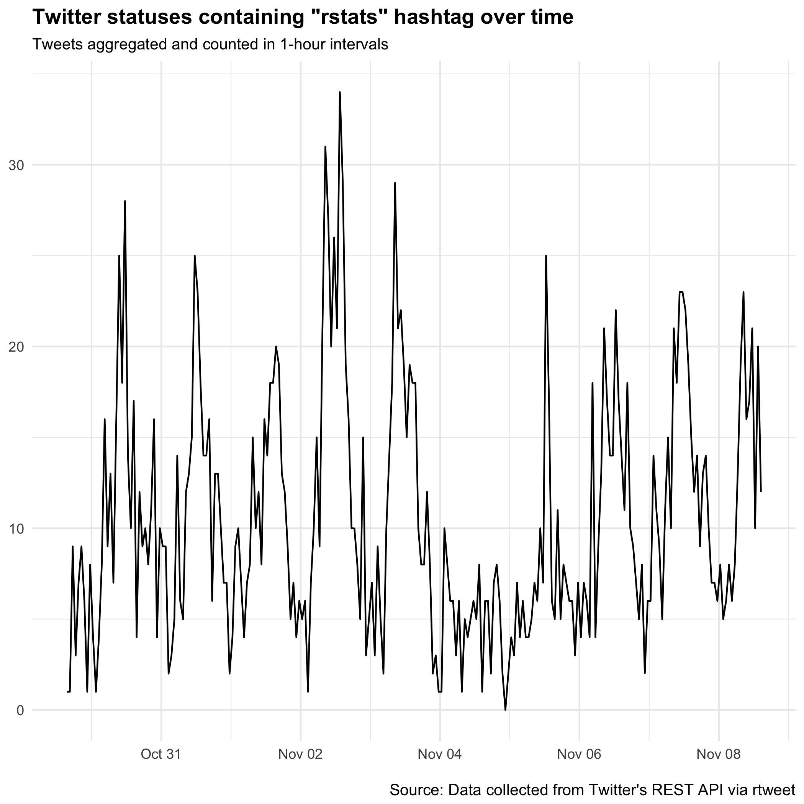
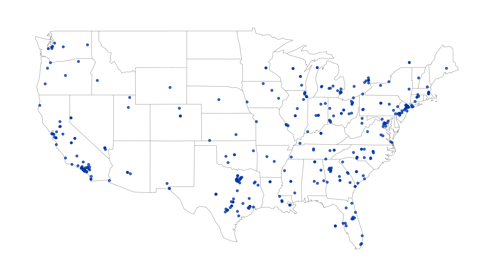
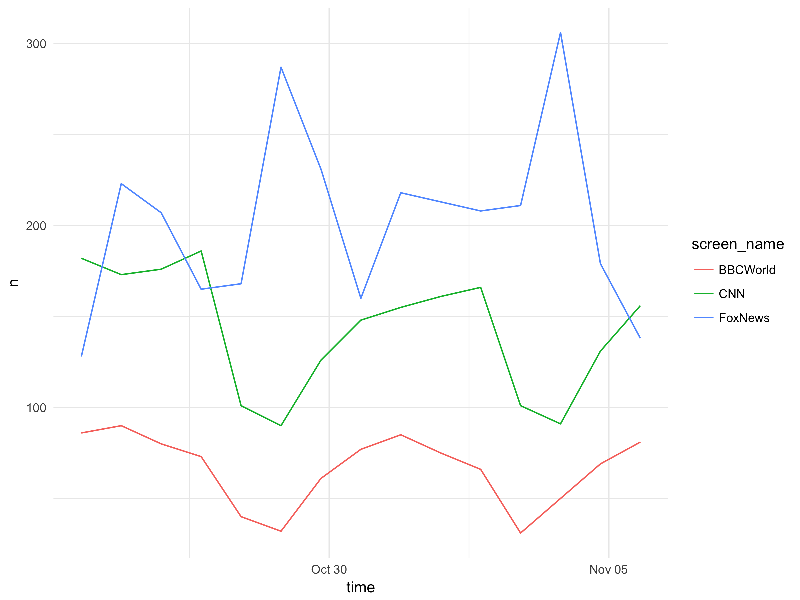

<!-- README.md is generated from README.Rmd. Please edit that file -->

```{r, echo = FALSE}
knitr::opts_chunk$set(
  collapse = TRUE,
  comment = "#>",
  fig.path = "README-"
)
```

# rtweet 

[](https://travis-ci.org/mkearney/rtweet)
[](https://CRAN.R-project.org/package=rtweet)


<!-- [](https://travis-ci.org/mkearney/rtweet) -->
<!-- [](https://codecov.io/gh/mkearney/rtweet) -->
[](http://www.rdocumentation.org/packages/rtweet)

R client for accessing Twitter's REST and stream APIs.

Check out the [rtweet package documentation website](http://rtweet.info).

Install
-------

To get the current released version from CRAN:

```{r, eval=FALSE}
## install rtweet from CRAN
install.packages("rtweet")

## load rtweet package
library(rtweet)
```

To get the current development version from Github:
```{r, eval=FALSE}
## install devtools package if it's not already
if (!"devtools" %in% installed.packages()) {
  install.packages("devtools")
}

## install dev version of rtweet from github
devtools::install_github("mkearney/rtweet")

## load rtweet package
library(rtweet)
```

## Getting started

- **NEW** Getting started with rtweet has gotten even easier.
  - **NO MORE CREATING TWITTER APPS**
  - **NO MORE DEALING WITH API/CONSUMER/SECRET/ACCESS KEYS**
  - **NO MORE COMPLICATED INSTRUCTIONS**
- All you need is a **Twitter account** + **rtweet** and you're up and running!
  - The first time you send a request to one of Twitter's
    APIs---e.g., `search_tweets()`, `stream_tweets()`,
    `get_followers()`, etc.---you'll be asked to authorize the rtweet
    application. And that's it! You're ready to start collecting and
    analyzing Twitter data!

### Search for tweets

Search for 1000 (non-retweeted) tweets containing the words "data" and
"science".

```{r, eval=FALSE}
## search for 5000 tweets using the rstats hashtag
rt <- search_tweets(
  "#rstats", n = 5000, include_rts = FALSE
)
```

Quickly visualize frequency of tweets over time using `ts_plot()`.

```{r, eval=FALSE}
## plot time series of tweets
ts_plot(rt, "hours") +
  ggplot2::theme_minimal() +
  ggplot2::theme(plot.title = ggplot2::element_text(face = "bold")) +
  ggplot2::labs(
    x = NULL, y = NULL,
    title = "Twitter statuses containing \"rstats\" hashtag over time",
    subtitle = "Tweets aggregated and counted in 1-hour intervals",
    caption = "\nSource: Data collected from Twitter's REST API via rtweet"
  )
```




Twitter rate limits cap the number of search results returned to
18,000 every 15 minutes. To request more than that, simply set
`retryonratelimit = TRUE` and rtweet will wait for rate limit
resets for you.

```{r, eval=FALSE}
## search for a quarter million tweets containing the word "data"
rt <- search_tweets(
  "data", n = 250000, retryonratelimit = TRUE
)
```

Search by geo-location---for example, find tweets in the English
language sent from the United States.

```{r, eval=FALSE}
## search for 10,000 tweets sent from the US
rt <- search_tweets(
  "lang:en", geocode = lookup_coords("usa"), n = 10000
)

## create lat/lng variables using all available tweet and profile geo-location data
rt <- lat_lng(rt)

## plot state boundaries
par(mar = c(0, 0, 0, 0))
maps::map("state", lwd = .25)

## plot lat and lng points onto state map
with(rt, points(lng, lat, pch = 20, cex = .75, col = rgb(0, .3, .7, .75)))
```



### Stream tweets

Randomly sample (approximately 1%) tweets as they occur.

```{r, eval=FALSE}
## random sample for 30 seconds
rt <- stream_tweets("")
```

Stream all geo enabled tweets from London for 60 seconds

```{r, eval=FALSE}
## stream tweets from london for 60 seconds
rt <- stream_tweets(lookup_coords("london, uk"), timeout = 60)
```

Stream all tweets mentioning @realDonaldTrump or Trump for a week.

```{r, eval=FALSE}
## stream tweets from london for 60 seconds
stream_tweets(
  "realdonaldtrump,trump", timeout = 60 * 60 * 24 * 7,
  file_name = "tweetsabouttrump.json"
)

## read in the data as a tidy tbl data frame
djt <- parse_stream("tweetsabouttrump.json")
```

### Get accounts followed by a user

Retrieve a list of all the accounts a **user follows**.

```{r, eval=FALSE}
## get user IDs of accounts followed by CNN
cnn_fds <- get_friends("cnn")

## lookup data on those accounts
cnn_fds_data <- lookup_users(cnn_fds$user_id)
```

### Get accounts following a user

Retrieve a list of all the **accounts following** a user.

```{r, eval=FALSE}
## get user IDs of accounts following CNN
cnn_flw <- get_followers("cnn", n = 75000)

## lookup data on those accounts
cnn_flw_data <- lookup_users(cnn_flw$user_id)
```


### User timelines

Get the most recent 3,200 tweets from different users


```{r, eval=FALSE}
## get user IDs of accounts followed by CNN
tmls <- get_timelines(c("cnn", "BBCWorld", "foxnews"), n = 3200)

## plot the frequency of tweets for each user over time
tmls %>%
  dplyr::filter(created_at > "2017-10-23") %>%
  dplyr::group_by(screen_name) %>%
  ts_plot("days", trim = 1L) +
  ggplot2::theme_minimal() +
  ggplot2::ggsave("example-tmls.png", width = 8, height = 6, units = "in")
```




## For post/DM permissions

- If you'd like to post Twitter statuses, follow or unfollow accounts,
and/or read your direct messages, you'll need to create your own
Twitter app.
- To create your own Twitter app, follow the instructions in the
  authorization vignette on [obtaining and using access tokens](http://rtweet.info/index.html).

- **Recommended authorization method**:
[Obtaining and using access tokens](http://rtweet.info/articles/auth.html)
(vignette showing how to *sustainably* setup authorization to use
Twitter's APIs).

## Vignettes

### [Obtaining and using user access tokens](http://rtweet.info/articles/auth.html)

```{r, eval=FALSE}
## authorizing API access
vignette("auth", package = "rtweet")
```

### [Quick overview of rtweet package](http://rtweet.info/articles/intro.html)

```{r, eval=FALSE}
## quick overview of rtweet functions
vignette("intro", package = "rtweet")
```

### [Live streaming tweets data](http://rtweet.info/articles/stream.html)

```{r, eval=FALSE}
## working with the stream
vignette("stream", package = "rtweet")
```

## Contact

Communicating with Twitter's APIs relies on an internet connection,
which can sometimes be inconsistent. With
that said, if you encounter an obvious bug for which there is not
already an active [issue](https://github.com/mkearney/rtweet/issues),
please
[create a new issue](https://github.com/mkearney/rtweet/issues/new)
with all code used (preferably a reproducible example) on Github.
