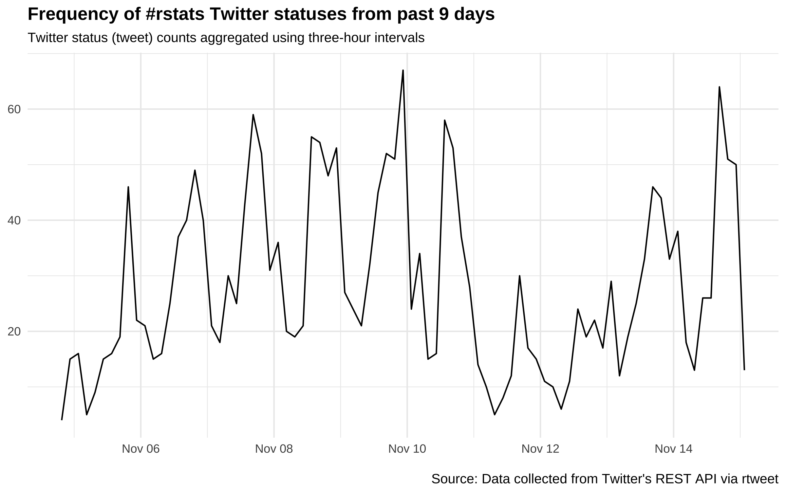

---
output:
  github_document:
    html_preview: false
---

<!-- README.md is generated from README.Rmd. Please edit that file -->
```{r, echo = FALSE}
knitr::opts_chunk$set(
  collapse = TRUE,
  comment = "#>",
  fig.path = "README-"
)
```

# rtweet 

[](https://travis-ci.org/mkearney/rtweet)
[](https://CRAN.R-project.org/package=rtweet)


<!-- [](https://travis-ci.org/mkearney/rtweet) -->
<!-- [](https://codecov.io/gh/mkearney/rtweet) -->
[](http://www.rdocumentation.org/packages/rtweet)

R client for accessing Twitter's REST and stream APIs.

Check out the [rtweet package documentation website](http://rtweet.info).

Install
-------

To get the current released version from CRAN:
```{r, eval=FALSE}
## install rtweet from CRAN
install.packages("rtweet")

## load rtweet package
library(rtweet)
```

To get the current development version from Github:
```{r, eval=FALSE}
## install devtools package if it's not already
if (!requireNamespace("devtools", quietly = TRUE)) {
  install.packages("devtools")
}

## install dev version of rtweet from github
devtools::install_github("mkearney/rtweet")

## load rtweet package
library(rtweet)
```

## Getting started

**NEW**: All you need is a **Twitter account** and **rtweet** and you're up and
running!

### API authorization
- The first time you make an API request---e.g.,
`search_tweets()`, `stream_tweets()`, `get_followers()`---a browser
window will open.
- Log in to your Twitter account.
- Agree/authorize the rtweet application.

And that's it! You're ready to start collecting and analyzing Twitter
data!

## Package features

### Search tweets

Search for up to 18,000 (non-retweeted) tweets containing the rstats hashtag.
```{r, eval=FALSE}
## search for 5000 tweets using the rstats hashtag
rt <- search_tweets(
  "#rstats", n = 18000, include_rts = FALSE
)
```

Quickly visualize frequency of tweets over time using `ts_plot()`.
```{r, eval=FALSE}
## plot time series of tweets
ts_plot(rt, "3 hours") +
  ggplot2::theme_minimal() +
  ggplot2::theme(plot.title = ggplot2::element_text(face = "bold")) +
  ggplot2::labs(
    x = NULL, y = NULL,
    title = "Frequency of #rstats Twitter statuses from past 9 days",
    subtitle = "Twitter status (tweet) counts aggregated using three-hour intervals",
    caption = "\nSource: Data collected from Twitter's REST API via rtweet"
  )
```


Twitter rate limits cap the number of search results returned to
18,000 every 15 minutes. To request more than that, simply set
`retryonratelimit = TRUE` and rtweet will wait for rate limit
resets for you.
```{r, eval=FALSE}
## search for 250,000 tweets containing the word data
rt <- search_tweets(
  "data", n = 250000, retryonratelimit = TRUE
)
```

Search by geo-location---for example, find 10,000 tweets in the English
language sent from the United States.
```{r, eval=FALSE}
## search for 10,000 tweets sent from the US
rt <- search_tweets(
  "lang:en", geocode = lookup_coords("usa"), n = 10000
)

## create lat/lng variables using all available tweet and profile geo-location data
rt <- lat_lng(rt)

## plot state boundaries
par(mar = c(0, 0, 0, 0))
maps::map("state", lwd = .25)

## plot lat and lng points onto state map
with(rt, points(lng, lat, pch = 20, cex = .75, col = rgb(0, .3, .7, .75)))
```


### Stream tweets

Randomly sample (approximately 1%) from the live stream of all tweets.
```{r, eval=FALSE}
## random sample for 30 seconds (default)
rt <- stream_tweets("")
```

Stream all geo enabled tweets from London for 60 seconds.
```{r, eval=FALSE}
## stream tweets from london for 60 seconds
rt <- stream_tweets(lookup_coords("london, uk"), timeout = 60)
```

Stream all tweets mentioning realDonaldTrump or Trump for a week.
```{r, eval=FALSE}
## stream london tweets for a week (60 secs x 60 mins * 24 hours *  7 days)
stream_tweets(
  "realdonaldtrump,trump",
  timeout = 60 * 60 * 24 * 7,
  file_name = "tweetsabouttrump.json",
  parse = FALSE
)

## read in the data as a tidy tbl data frame
djt <- parse_stream("tweetsabouttrump.json")
```

### Get friends

Retrieve a list of all the accounts a **user follows**.
```{r, eval=FALSE}
## get user IDs of accounts followed by CNN
cnn_fds <- get_friends("cnn")

## lookup data on those accounts
cnn_fds_data <- lookup_users(cnn_fds$user_id)
```

### Get followers

Retrieve a list of the **accounts following** a user.
```{r, eval=FALSE}
## get user IDs of accounts following CNN
cnn_flw <- get_followers("cnn", n = 75000)

## lookup data on those accounts
cnn_flw_data <- lookup_users(cnn_flw$user_id)
```

Or if you really want ALL of their followers:
```{r, eval=FALSE}
## how many total follows does cnn have?
cnn <- lookup_users("cnn")

## get them all (this would take a little over 5 days)
cnn_flw <- get_followers(
  "cnn", n = cnn$followers_count, retryonratelimit = TRUE
)
```

### Get timelines

Get the most recent 3,200 tweets from cnn, BBCWorld, and foxnews.
```{r, eval=FALSE}
## get user IDs of accounts followed by CNN
tmls <- get_timelines(c("cnn", "BBCWorld", "foxnews"), n = 3200)

## plot the frequency of tweets for each user over time
tmls %>%
  dplyr::filter(created_at > "2017-10-29") %>%
  dplyr::group_by(screen_name) %>%
  ts_plot("days", trim = 1L) +
  ggplot2::geom_point() +
  ggplot2::theme_minimal() +
  ggplot2::theme(
    legend.title = ggplot2::element_blank(),
    legend.position = "bottom",
    plot.title = ggplot2::element_text(face = "bold")) +
  ggplot2::labs(
    x = NULL, y = NULL,
    title = "Frequency of Twitter statuses posted by news organization",
    subtitle = "Twitter status (tweet) counts aggregated by day from October/November 2017",
    caption = "\nSource: Data collected from Twitter's REST API via rtweet"
  )
```


### Get favorites

Get the 3,000 most recently favorited statuses by JK Rowling.
```{r, eval=FALSE}
jkr <- get_favorites("jk_rowling", n = 3000)
```

### Search users

Search for 1,000 users with the rstats hashtag in their profile bios.
```{r, eval=FALSE}
## search for users with #rstats in their profiles
usrs <- search_users("#rstats", n = 1000)
```

### Get trends

Discover what's currently trending in San Francisco.
```{r, eval=FALSE}
sf <- get_trends("san francisco")
```

## For posting (tweeting from R console) or read DM permissions

- If you'd like to post Twitter statuses, follow or unfollow accounts,
and/or read your direct messages, you'll need to create your own
Twitter app.
- To create your own Twitter app, follow the instructions in the
  authorization vignette on [obtaining and using access tokens](http://rtweet.info/articles/auth.html).

```{r, eval=FALSE}
## authorizing API access
vignette("auth", package = "rtweet")
```

## Other vignettes

[Quick overview of rtweet package](http://rtweet.info/articles/intro.html)
```{r, eval=FALSE}
## quick overview of rtweet functions
vignette("intro", package = "rtweet")
```

[Live streaming tweets data](http://rtweet.info/articles/stream.html)
```{r, eval=FALSE}
## working with the stream
vignette("stream", package = "rtweet")
```

## Contact

Communicating with Twitter's APIs relies on an internet connection,
which can sometimes be inconsistent. With that said, if you encounter
an obvious bug for which there is not already an active
[issue](https://github.com/mkearney/rtweet/issues), please [create a
new issue](https://github.com/mkearney/rtweet/issues/new) with all
code used (preferably a reproducible example) on Github.
