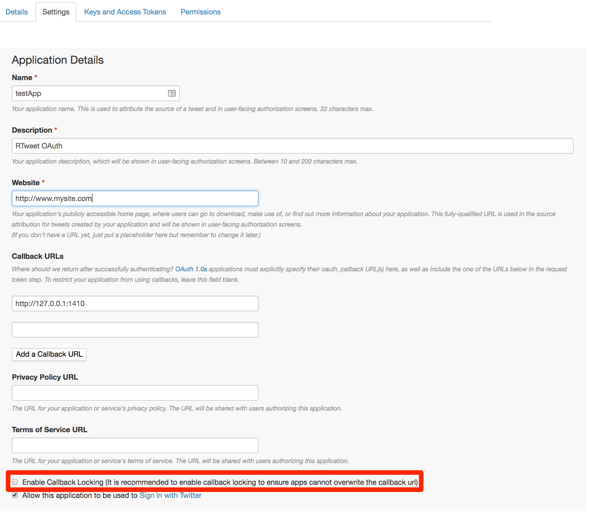

```{r, include=FALSE}
knitr::opts_chunk$set(
    echo = TRUE, eval = FALSE, comment = "#>", collapse = TRUE)
```

## rtweet

This vignette covers how to obtain and use Twitter API access tokens
for use in the `rtweet` package.

```{r}
# install from CRAN
install.packages("rtweet")

# load rtweet
library(rtweet)
```

## Creating a Twitter App

- To create a Twitter app, navigate to [apps.twitter.com](https://apps.twitter.com/)
and create a new app by providing a `Name`, `Description`, and
`Website` of your choosing (example screenshot provided below).
- **Important** In the `Callback URL` field, make sure to enter the
  following: `http://127.0.0.1:1410`
- Check yes if you agree and then click "Create your Twitter application".

<p align="center">

</p>

- Once you've successfully created an app, go to the `Settings` tab for your app
and uncheck the `Enable callback locking` setting, which Twitter enables by default.
Failure to uncheck this box will result in a 403 error.

<p align="center">

</p>

- Next, click the tab labeled
  `Keys and Access Tokens` to retrieve your consumer (api) and secret
  keys.

<p align="center">

</p>

- To create a personal access token, users must provide their
  `Consumer Key` (aka "API Key") and `Consumer Secret` (aka "API
  Secret").

- I've highlighted the keys in the screen shot below.

<p align="center">

</p>

- Copy and paste these keys into an R script file and assign them to
  objects like I've done in the code below.

- Once the keys are read into R, use `create_token()` and store
  the output as `twitter_token`.

- The `create_token()` function will save your token as an environment variable for you. To make sure it worked, compare the created token object to the object returned by `get_token()`

```{r}
## whatever name you assigned to your created app
appname <- "rtweet_token"

## api key (example below is not a real key)
key <- "XYznzPFOFZR2a39FwWKN1Jp41"

## api secret (example below is not a real key)
secret <- "CtkGEWmSevZqJuKl6HHrBxbCybxI1xGLqrD5ynPd9jG0SoHZbD"

## create token and save it as an environment variable
twitter_token <- create_token(
  app = appname,
  consumer_key = key,
  consumer_secret = secret)

## check to see if the token is loaded
identical(twitter_token, get_token())
```

That's it!
