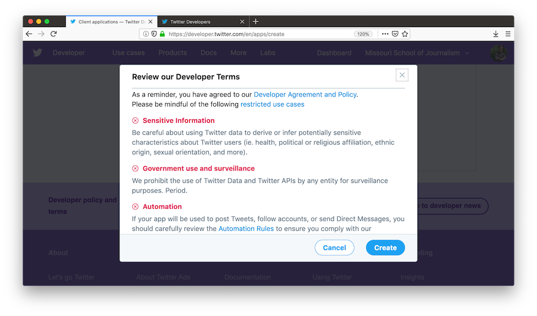
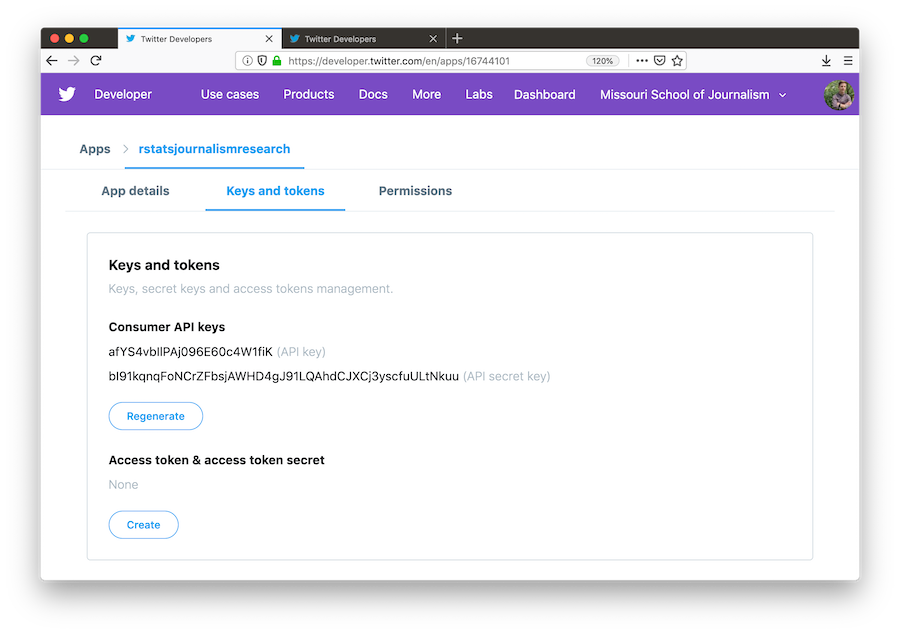

```{r, include=FALSE}
knitr::opts_chunk$set(echo = TRUE, eval = FALSE, comment = "#>", collapse = TRUE)
```

## rtweet

This vignette covers how to obtain and use Twitter API access tokens for use in the `rtweet` package.

## Creating a Twitter App

- To create a Twitter app, you will first need to apply for a developer account. This process along with a detailed explanation can be found at [developer.twitter.com](https://developer.twitter.com).

- Once you have acquired a developer account, navigate to [developer.twitter.com/en/apps](https://developer.twitter.com/en/apps/), click the blue button that says, `Create a New App`, and then complete the form with the following fields:
   + `App Name`: What your app will be called
   + `Application Description`: How your app will be described to its users
   <p align="center"></p>
   + `Website URLs`: Website associated with app–I recommend using the URL to your Twitter profile
   + `Callback URLs`: ***IMPORTANT*** enter exactly the following: `http://127.0.0.1:1410`
   <p align="center"></p>
   + `Tell us how this app will be used`: Be clear and honest
   <p align="center"></p>
- When you've completed the required form fields, click the blue `Create` button at the bottom
- Read through and indicate whether you accept the developer terms
   <p align="center"></p>
- And you're done!
   <p align="center"></p>

## Authorization methods

Users can create their personal Twitter token in two different ways. Each method is outlined below.

### 1. Browser-based authentication

- Authentication via web browser requires the `httpuv` package to be installed.

```{r}
## install httpuv if not already
if (!requireNamespace("httpuv", quietly = TRUE)) {
  install.packages("httpuv")
}
```

- Navigate to [developer.twitter.com/en/apps](https://developer.twitter.com/en/apps) and select your Twitter app
- Click the tab labeled `Keys and tokens` to retrieve your keys.
- Locate the `Consumer API keys` (aka "API Secret").

<p align="center"></p>

- Copy and paste the two keys (along with the name of your app) into an R script file and pass them along to `create_token()`.

```{r}
## load rtweet
library(rtweet)

## store api keys (these are fake example values; replace with your own keys)
api_key <- "afYS4vbIlPAj096E60c4W1fiK"
api_secret_key <- "bI91kqnqFoNCrZFbsjAWHD4gJ91LQAhdCJXCj3yscfuULtNkuu"

## authenticate via web browser
token <- create_token(
  app = "rstatsjournalismresearch",
  consumer_key = api_key,
  consumer_secret = api_secret_key)
```

- A browser pop-up window should appear. Click to approve (must be signed into twitter.com) and return to R.
- Your token has been created. Print your token to make sure the app name and `api_key` match

```{r}
## view token (you should see the correct app name)
token
```

### 2. Access token/secret method

- Navigate to [developer.twitter.com/en/apps](https://developer.twitter.com/en/apps) and select your Twitter app
- Click the tab labeled `Keys and tokens` to retrieve your keys.
- Locate the `Consumer API keys` (aka "API Secret").

<p align="center"></p>

- Scroll down to `Access token & access token secret` and click `Create`

<p align="center"></p>

- Copy and paste the four keys (along with the name of your app) into an R script file and pass them along to `create_token()`.

```{r}
## store api keys (these are fake example values; replace with your own keys)
api_key <- "afYS4vbIlPAj096E60c4W1fiK"
api_secret_key <- "bI91kqnqFoNCrZFbsjAWHD4gJ91LQAhdCJXCj3yscfuULtNkuu"
access_token <- "9551451262-wK2EmA942kxZYIwa5LMKZoQA4Xc2uyIiEwu2YXL"
access_token_secret <- "9vpiSGKg1fIPQtxc5d5ESiFlZQpfbknEN1f1m2xe5byw7"

## authenticate via web browser
token <- create_token(
  app = "rstatsjournalismresearch",
  consumer_key = api_key,
  consumer_secret = api_secret_key,
  access_token = access_token,
  access_secret = access_token_secret)
```

## Authorization in future R sessions

- The `create_token()` function should automatically save your token as an environment variable for you. So next time you start an R session [on the same machine], rtweet should automatically find your token.
- To make sure it works, restart your R session, run the following code, and again check to make sure the app name and `api_key` match.

```{r}
## check to see if the token is loaded
library(rtweet)
get_token()
```

That's it!
