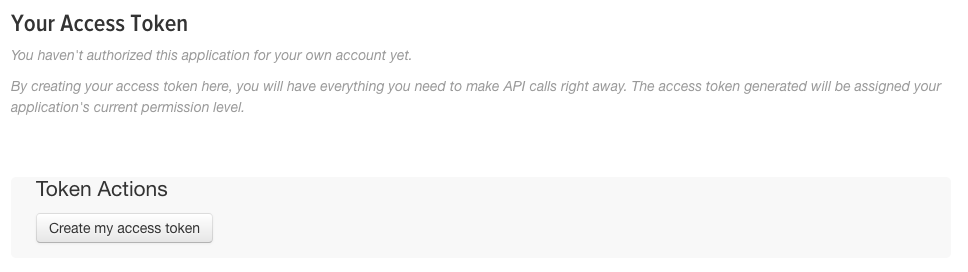
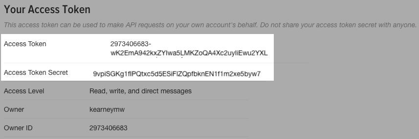

```{r, include=FALSE}
knitr::opts_chunk$set(echo = TRUE, eval = FALSE, comment = "#>", collapse = TRUE)
```

## rtweet

This vignette covers how to obtain and use Twitter API access tokens for use in the `rtweet` package.

## Creating a Twitter App

- To create a Twitter app, navigate to [apps.twitter.com](https://apps.twitter.com/) and create a new app by providing a `Name`, `Description`, and `Website` of your choosing (example screenshot provided below).

- **Important** In the `Callback URL` field, make sure to enter the following: `http://127.0.0.1:1410`

- Check yes if you agree and then click "Create your Twitter application".

<p align="center">

</p>

## Authorization methods

Users can create their personal access token in two different ways. Each method is outlined below.

### 1. Browser-based authentication

- Authentication via web browser requires the `httpuv` package to be installed.

```{r}
## install httpuv if not already
if (!requireNamespace("httpuv", quietly = TRUE)) {
  install.packages("httpuv")
}
```

- Click the tab labeled `Keys and Access Tokens` to retrieve your keys.

<p align="center">

</p>

- In the `Keys and Access Tokens` tab, locate the values `Consumer Key` (aka "API Key") and `Consumer Secret` (aka "API Secret").

<p align="center">

</p>

- Copy and paste the two keys (along with the name of your app) into an R script file and pass them along to `create_token()`.

```{r}
## autheticate via web browser
token <- create_token(
  app = "rtweet_token",
  consumer_key = "XYznzPFOFZR2a39FwWKN1Jp41",
  consumer_secret = "CtkGEWmSevZqJuKl6HHrBxbCybxI1xGLqrD5ynPd9jG0SoHZbD")
```

- A browser window should pop up. Click to approve (must be signed into twitter.com) and return to R.

- The `create_token()` function should automatically save your token as an environment variable for you. To make sure it worked, compare the created token object to the object returned by `get_token()`

```{r}
## check to see if the token is loaded
identical(twitter_token, get_token())
```


### 2. Access token/secret method

- Click the tab labeled `Keys and Access Tokens` to retrieve your keys.

<p align="center">

</p>

- In the `Keys and Access Tokens` tab, locate and copy/paste values `Consumer Key` (aka "API Key") and `Consumer Secret` (aka "API Secret") into an R script.

<p align="center">

</p>

- In the `Keys and Access Tokens` tab, scroll down to `Token Actions` and click `Create my access token`.

<p align="center">

</p>

- That should generate two access keys `Access Token` and `Access Token Secret`

<p align="center">

</p>

- Locate and copy/paste the `Consumer Key` (aka "API Key"), `Consumer Secret` (aka "API Secret"), `Access Token`, and `Access Token Secret` values and pass them along to `create_token()`, storing the output as a `token` object.

```{r}
## authenticate via access token
token <- create_token(
  app = "my_twitter_research_app",
  consumer_key = "XYznzPFOFZR2a39FwWKN1Jp41",
  consumer_secret = "CtkGEWmSevZqJuKl6HHrBxbCybxI1xGLqrD5ynPd9jG0SoHZbD",
  acess_token = "9551451262-wK2EmA942kxZYIwa5LMKZoQA4Xc2uyIiEwu2YXL",
  access_secret = "9vpiSGKg1fIPQtxc5d5ESiFlZQpfbknEN1f1m2xe5byw7")
```

- The `create_token()` function should automatically save your token as an environment variable for you. To make sure it worked, compare the created token object to the object returned by `get_token()`

```{r}
## check to see if the token is loaded
identical(twitter_token, get_token())
```


That's it!
