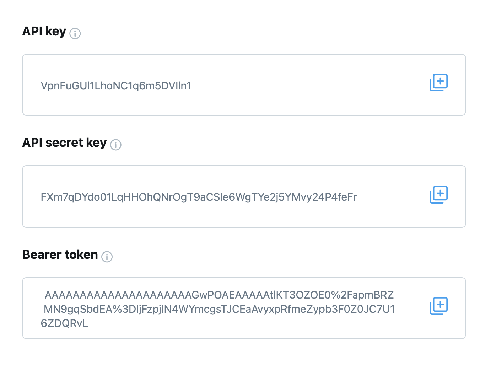
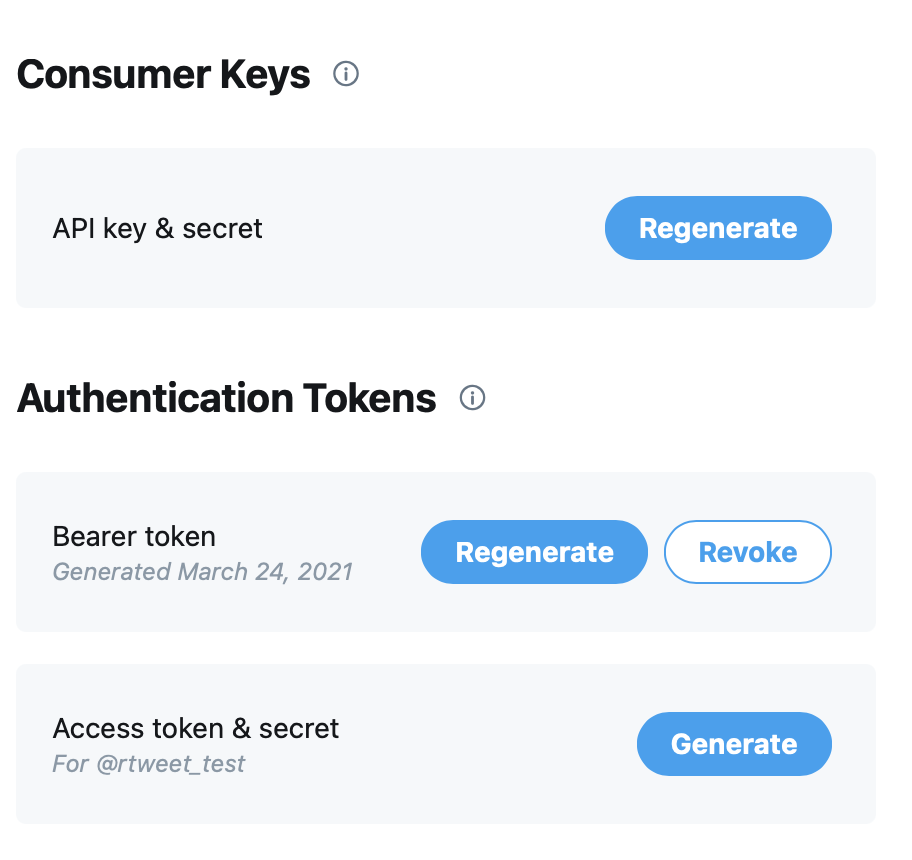

```{r, include=FALSE}
knitr::opts_chunk$set(echo = TRUE, eval = FALSE, comment = "#>", collapse = TRUE)
```

rtweet's default authentication mechanism (`auth_setup_default()`) allows you to act on behalf of your personal Twitter account, as if you were performing actions on twitter.com.
This mechanism is very simple to set up, but is best suited for casual use.

If you want to collect a lot of data or implement a bot, you should instead use one of rtweet's two other authentication mechanisms:

-   **App authentication** allows you to act as if you were a Twitter app.
    You can't perform operations that a user can (like posting a tweet or reading a DM), but you get higher rate limits on data collection operations.

-   **Bot authentication** allows you to create a fully automated Twitter bot that performs actions on its own behalf rather than on behalf of a human.

In either case, you'll need to create your own Twitter app, so we'll start by discussing what an app is and how to create one on the Twitter website.
Next, you'll learn how to use the `rtweet_app()` and `rtweet_bot()` functions to tell rtweet about your app config.
You'll then learn how to set the default authentication mechanism for the current R session, and how to save it so you can use it in a future session.

```{r}
library(rtweet)
```

## Creating a Twitter app

You're already familiar with using twitter, either through [the website](https://twitter.com) or an app that you installed on your phone or computer.
To use twitter from R, you'll need to learn a little more about what's going on behind the scenes.
The first important concept to grasp is that every request to the Twitter API has to go through an "app".
Normally, someone else has created the app for you, but now that you're using twitter programmatically, you need to create your own app.
(It's still called an app even though you'll be using it through an R package).

To create a Twitter app, you need to first apply for a developer account by following the instructions at <https://developer.twitter.com>.
Once you have been approved (which may take several hours), navigate to the [developer portal](https://developer.twitter.com/en/portal/projects-and-apps) and click the "Create App" button at the bottom of the page.
You'll need to name your app: the name is unimportant for our purposes, but needs to be unique across all twitter apps.

After you've created your app, you'll see a screen that gives you some important information.
You'll only see this once, so make sure to record it in a secure location.

{width="548"}

(Don't worry if you forget to save this data: you can always regenerate new values by clicking the "regenerate" button on the "keys and tokens" page.)

## Setup

Now that you have an app, you have to tell rtweet about it.
You'll use either `rtweet_app()` or `rtweet_bot()` depending on whether you want app-style authentication or bot-style authentication as described above.

### rtweet_app()

To use app based authentication, run this code:

```{r, eval = FALSE}
auth <- rtweet_app()
```

This will prompt you to enter the bearer token that you recorded earlier.

It's good practice to only provide secrets interactively, because that makes it harder to accidentally share them in either your `.Rhistory` or an `.R` file.

### `rtweet_bot()`

Bot based authentication works similarly:

```{r, eval = FALSE}
auth <- rtweet_bot()
```

But you'll need more data --- as well as the API key and secret you recorded earlier, you'll also need to generate a "Access token and secret" which you can get by clicking the "Generate" button on the Keys and Tokens page:

{width="362"}

Again, you'll want to record this data in a secure place because you only get to see it once.

## Default auth

Now you have an auth object that you can provide to the `token` argument of any rtweet function:

```{r, eval = FALSE}
df <- search_tweets("#rstats", token = auth)
```

It's a good idea to do this once to check that you've entered all the app data correctly, but it'd be annoying if you had to pass this object around every single time.
Instead, you can call `auth_as()` to set this as the default for the remainder of the session:

```{r, eval = FALSE}
auth_as(auth)
```

## Saving and loading

`auth_as()` only lasts for a single session; if you close and re-open R, you'll need to repeat the whole process.
This would be annoying (!) so rtweet also provides a way to save and reload auth across sessions:

```{r, eval = FALSE}
auth_save(auth, "some-name")
```

The second argument to `auth_save()` can be any string.
It just needs to be meaningful to you so that you remember exactly what you're loading when you use it a future session:

```{r, eval = FALSE}
auth_as("some-name")
```

You can see all the authentication options you have saved with `auth_list()`.
