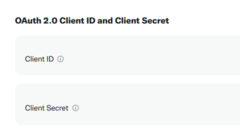

```{r, include=FALSE}
knitr::opts_chunk$set(echo = TRUE, eval = FALSE, comment = "#>", collapse = TRUE)
```

rtweet's default authentication is shared by all user.
If it is just for a test, a workshop or a lecture it is fine.
But if you plan to use it more than a day you will benefit of authenticating yourself.

The **authentication** mechanism is using your own app authentication.
It allows you to act on behalf of your personal Twitter account, as if you were performing actions on twitter.com.

If you want to collect a lot of data or implement a bot, you should instead use one of rtweet's two other authentication mechanisms:

-   **App authentication** allows you to act as if you were a Twitter app.
    You can't perform operations that a user can (like posting a tweet or reading a DM), but you get higher rate limits on data collection operations.

-   **Bot authentication** allows you to create a fully automated Twitter bot that performs actions on its own behalf rather than on behalf of a human.

In either case, you'll need to create your own Twitter app (yes, it can be confusing), so we'll start by discussing what an app is and how to create one on the Twitter website.
Next, you'll learn how to use the `rtweet_app()` function to tell rtweet about your app config.
You'll then learn how to set the default authentication mechanism for the current R session, and how to save it so you can use it in a future session.

```{r}
library(rtweet)
```

## Creating a Twitter app

You're already familiar with using twitter, either through [the website](https://twitter.com) or an app that you installed on your phone or computer.
To use twitter from R, you'll need to learn a little more about what's going on behind the scenes.
The first important concept to grasp is that every request to the Twitter API has to go through an "app".
Normally, someone else has created the app for you, but now that you're using twitter programmatically, you can create your own app.
(It's still called an app even though you'll be using it through an R package).

To create a Twitter app, you need to first apply for a developer account by following the instructions at <https://developer.twitter.com>.
Once you have been approved (which may take several hours), navigate to the [developer portal](https://developer.twitter.com/en/portal/projects-and-apps) and click the "Create App" button at the bottom of the page.
You'll need to name your app: the name is unimportant for our purposes, but needs to be unique across all twitter apps.

After you've created your app, you'll see a screen that gives you some important information.
You'll only see this once, so make sure to record it in a secure location.

{width="548"}

Don't worry if you forget to save this data: you can always regenerate new values by clicking the "regenerate" button on the "keys and tokens" page.
If you regenerate the previous values will cease to work, so do not use it to get different credentials for an authentication already in use.

## Setup

Now that you have an app registered on twitter.com, you have to tell rtweet about it.

#### OAuth2 protocol

Some new functions require a different authentication mechanism[^1].
This functions will need you to first set up a client, which requires your client id and secret.

[^1]: Called [OAuth 2](https://aaronparecki.com/oauth-2-simplified/)

You can get them in your [developer dashboard](https://developer.twitter.com/en/portal/dashboard) after selecting your app, you first need to fill the details of the "User authentication settings":

Choose one of the **App permissions**: Read, Read and write, or Read and write and Direct message  
In **Type of App** select Native app  
In **App info**  set the callback URI to: `http://127.0.0.1:1410/`

The callback URI is important as this is what rtweet will use to validate.

The clients are under "Key and tokens" tab, check the top.
At the last section of the tab, there is the section \"Auth 2.0 Client ID and Client Secret\":

{width="548"}

Use them to set up your client app:

```{r client, eval = FALSE}
client <- rtweet_client(app = "my app")
```

Once you get your client you'll need to tell rtweet to use it (that's why we use `client_as()`).
But first you'll need to authorize it via `rtweet_oauth2()`: 
It will ask your default browser to authorize the client.
You should have a Twitter session to authorize rtweet.

```{r rtweet_oauth2}
user_oauth2 <- rtweet_oauth2()
## Waiting for authentication in browser...
## Press Esc/Ctrl + C to abort
auth_as(user_oauth2)
auth_save(user_oauth2, "oauth2_authentication")
```

This authentication only last for 2 hours.
You'll be asked to renew the authorization if it is expired. 

### Apps

To use app based authentication, run this code:

```{r, eval = FALSE}
auth <- rtweet_app()
```

This will prompt you to enter the *bearer token* that you recorded earlier.

It's good practice to only provide secrets interactively, because that makes it harder to accidentally share them in either your `.Rhistory` or an `.R` file.


## Default

You can call `auth_as()` to set this as the default for the remainder of the session:

```{r, eval = FALSE}
auth_as(auth)
```

Similarly you can use by default a client.

```{r, eval = FALSE}
client_as(client)
```


## Saving and loading {#save}

`auth_as()` only lasts for a single session; if you close and re-open R, you'd need to repeat the whole process (generate the tokens and pass them to `rtweet_app()` or `rtweet_oauth2()`).
This would be annoying (!) so rtweet also provides a way to save and reload authentications across sessions:

```{r, eval = FALSE}
auth_save(auth, "some-name")
```

The second argument to `auth_save()` can be any string.
It just needs to be meaningful to you so that you remember exactly what you're loading when you use it a future session:

```{r, eval = FALSE}
auth_as("some-name")
```

You can see all the authentication options you have saved with `auth_list()`.
`auth_list()` reports all the available authentications at the default location (See `auth_save()` details).
If you use an authentication saved on a different path you can directly use it `auth_as("../authentications/rtweet.rds")`

So, after your initial setup you can start all your scripts with `auth_as("default")` to load it.

Clients work similarly, but the client will be saved with the name of the app you provided:

```{r, eval=FALSE}
client_save(client)
client_as("myapp")
```


### On continuous integration workflows

On continuous integration you need to provide the keys and tokens as secret variables.
Otherwise anyone with access to the logs of those checks might use your keys and tokens.
Check your CI documentation about how to do that, but it might be something similar to what [Github does](https://docs.github.com/en/actions/security-guides/encrypted-secrets#creating-encrypted-secrets-for-a-repository).
Where secrets are created as environmental variables.

You will need to provide a name of your variable, try to be informative (RTWEET_BEARER, RTWEET_API_KEY, RTWEET_API_SECRET, RTWEET_TOKEN, RTWEET_SECRET).

Usually you later need to load them from the environmental variables and create the token on the CI:

``` r
app <- rtweet_app(bearer_token = Sys.getenv("RTWEET_BEARER"))
auth_as(app)
```

Don't leave the arguments without values as this won't authenticate.
Also do not print RTWEET_BEARER or other secrets.

## Authentications sitrep

On the rtweet 1.0.0 version there were some changes on the default location of the tokens.

If you upgrade or want a complete check up of your authentications you can use `auth_sitrep()`.
It can help when regenerating credentials and to follow best practices when upgrading rtweet.
It will print something like these:

```{r, eval = FALSE}
auth_sitrep()
## Tokens from rtweet version < 1.0.0 found on /home/user:
## Empty tokens were found.
## Choose which is the best path of action for the tokens:
##                              user_id  key
## .rtweet_token.rds      My app         <NA>
## .rtweet_token1.rds My account            A
## Tokens found on /home/user/.config/R/rtweet:
##             token
## my-app2.rds     A
## Multiple authentications with the same app found!
## Choose which is the best path of action for the tokens:
##                       app    user_id key
## default.rds        rtweet 9951053384   A
## testing_rtweet.rds rtweet              B
## All tokens should be moved to /home/user/.config/R/rtweet
```

First looks up old authentications rtweet saved at your home directory (`~`, or `$HOME`) as it did on rtweet \< 1.0.0.
Then it reports the authentications found on the new location (rtweet \>= 1.0.0).
For each folder it reports apps and then users and bots authentications.
It is safe to use in public, as instead of the tokens or keys it reports a letter.
For users authentications it reports the user_id, so that you can check who is that user (`user_search("1251053384")`).

This makes it easier to see if there is a saved authentication with a name not matching the user_id.
It also warns you if there is the same key or token for multiple files, as this indicates a misunderstanding or a duplication of the authentication.
