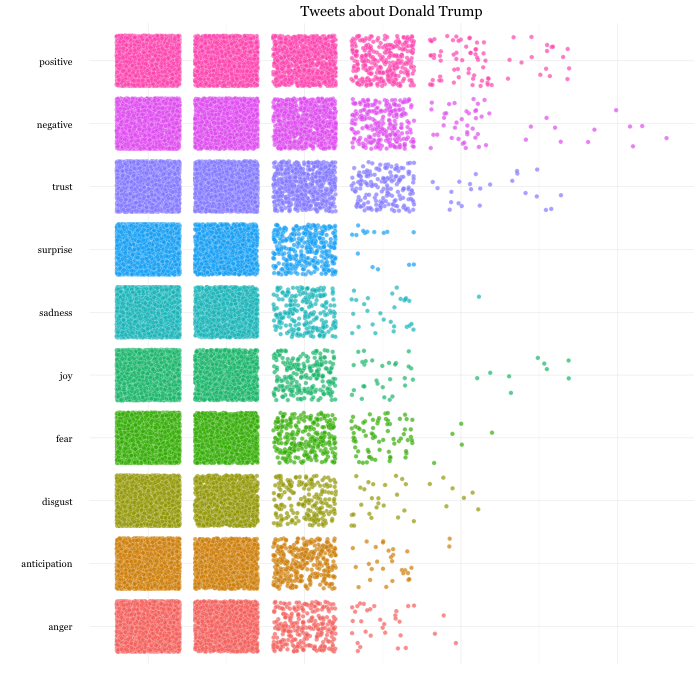

## Sentiment Analysis with rtweet

Install and load necessary packages.

```{r, eval=FALSE}
# install packages as necessary
install.packages(c("syuzhet", "rtweet", "ggplot2", "reshape2"))

# load rtweet and ggplot
library(rtweet)
library(ggplot2)
```
### Tweets about Donald Trump

```{r, eval=FALSE}
# search for 10,000 tweets mentioning realdonaldtrump
dt <- search_tweets("realdonaldtrump", n = 10000)

# conducing a sentiment analysis is super easy
sa_trump <- syuzhet::get_nrc_sentiment(dt$text)

# output contains 8 emotion scores (columns) for each row
head(sa_trump)

# subset rtweet data (for ease) and combine with sentiment data
d <- cbind(
  dt[, c("status_id", "favorite_count", "retweet_count")],
  sa_trump)

# transform data to long form (makes plotting easier)
d <- reshape2::melt(d,
	variable.name = "emotion",
	value.name = "sentiment",
	id.vars = c("status_id", "favorite_count", "retweet_count"))

# plot using ggplot
p_dt <- ggplot(d, aes(x = emotion, y = sentiment,
  fill = emotion)) + theme_minimal() +
  coord_cartesian(ylim = c(0, 7)) +
  geom_jitter(color = "#ffffff", shape = 21,
    size = 2, alpha = .7, stroke = .15) +
  coord_flip() + labs(y = "", x = "",
    title = "Tweets about Donald Trump") +
  theme(legend.position = "none",
    text = element_text("Georgia", size = 18),
    axis.text.x = element_blank())
p_dt

# save plot image
png("/Users/mwk/r/dt.png", 500, 500)
p_dt
dev.off()
```

<p align="center">

</p>

### Tweets about Hillary Clinton

```{r, eval=FALSE}
# search for 10,000 tweets mentioning hillaryclinton
hc <- search_tweets("hillaryclinton", n = 10000)

# conducing a sentiment analysis is super easy
sa_clinton <- syuzhet::get_nrc_sentiment(hc$text)

# output contains 8 emotion scores (columns) for each row
head(sa_clinton)

# subset rtweet data (for ease) and combine with sentiment data
h <- cbind(
  hc[, c("status_id", "favorite_count", "retweet_count")],
  sa_clinton)

# transform data to long form
h <- reshape2::melt(h,
	variable.name = "emotion",
	value.name = "sentiment",
	id.vars = c("status_id", "favorite_count", "retweet_count"))

# plot using ggplot
p_hc <- ggplot(h, aes(x = emotion, y = sentiment,
  fill = emotion)) + theme_minimal() +
  coord_cartesian(ylim = c(0, 7)) +
  geom_jitter(color = "#ffffff", shape = 21,
    size = 2, alpha = .7, stroke = .15) +
  coord_flip() + labs(y = "", x = "",
    title = "Tweets about Hillary Clinton") +
  theme(legend.position = "none",
    text = element_text("Georgia", size = 18),
    axis.text.x = element_blank())
p_hc

# save plot image
png("/Users/mwk/r/hc.png", 500,500)
p_hc
dev.off()
```

<p align="center">

</p>
