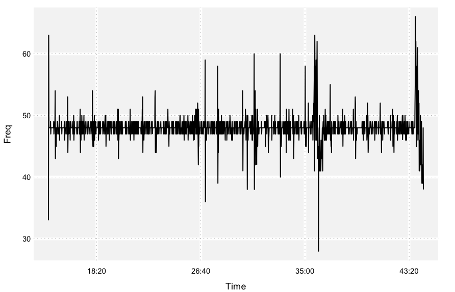
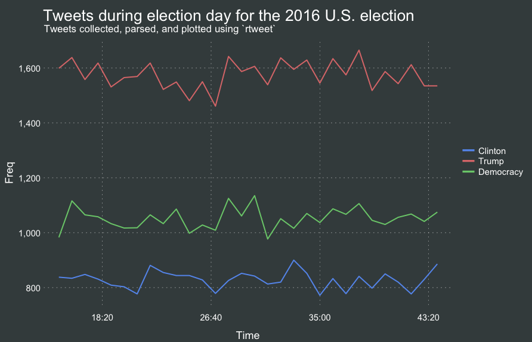

```{r, include=FALSE}
knitr::opts_chunk$set(
  echo = TRUE, eval = FALSE, comment = "#>", collapse = TRUE)
```

## Installing and loading package

Prior to streaming, make sure to install and load rtweet. This
vignette assumes users have already setup user access tokens (see: [obtaining and using access tokens](https://mkearney.github.io/rtweet/articles/auth.html)).

```{r}
## Install rtweet
install.packages("rtweet")
## Load rtweet
library(rtweet)
```

## Specifying parameters

In addition to accessing Twitter's REST API (e.g., `search_tweets`,
`get_timeline`), rtweet makes it possible to capture live streams of
Twitter data using the `stream_tweets()` function. By default,
`stream_tweets` will stream for 30 seconds and return a random sample
of tweets. To modify the default settings, `stream_tweets` accepts
several parameters, including `q` (query used to filter tweets),
`timeout` (duration or time of stream), and `file_name` (path name for
saving raw json data).

```{r}
## Stream keywords used to filter tweets
q <- "hillaryclinton,imwithher,realdonaldtrump,maga,electionday"

## Stream time in seconds so for one minute set timeout = 60
## For larger chunks of time, I recommend multiplying 60 by the number
## of desired minutes. This method scales up to hours as well
## (x * 60 = x mins, x * 60 * 60 = x hours)
## Stream for 30 minutes
streamtime <- 30 * 60

## Filename to save json data (backup)
filename <- "rtelect.json"
```

## stream_tweets()

Once these parameters are specified, initiate the stream. Note:
Barring any disconnection or disruption of the API, streaming will
occupy your current instance of R until the specified time has
elapsed. It is possible to start a new instance or R---streaming
itself usually isn't very memory intensive---but operations may drag a
bit during the parsing process which takes place immediately after
streaming ends.

```{r}
## Stream election tweets
rt <- stream_tweets(q = q, timeout = streamtime, file_name = filename)
```

Parsing larger streams can take quite a bit of time (in addition to
time spent streaming) due to a somewhat time-consuming simplifying
process used to convert a json file into an R object. For example, the
stream above yielded a little over 140,000 tweets and took my Macbook
Air, which has 4gb of RAM, about 10 minutes to process.

## Saving files

Given a lengthy parsing process, users may want to stream tweets into
json files upfront and parse those files later on. To do this, simply
add `parse = FALSE` and make sure you provide a path (file name) to a
location you can find later. To ensure the stream automatically reconnects following
any interruption prior to the specified stream time, use
`stream_tweets2()`.

Regardless of whether you decide to setup an organizational system for
streaming data, the process of streaming a file to disk and parsing it
at a later point in space-time is the same, as illustrated in the example
below.

```{r}
## No upfront-parse save as json file instead method
stream_tweets(
  q = q,
  parse = FALSE,
  timeout = streamtime,
  file_name = filename
)
## Parse from json file
rt <- parse_stream(filename)

## stream_tweets2 method
twoweeks <- 60L * 60L * 24L * 7L * 2L
congress <- "congress,senate,house of representatives,representatives,senators,legislative"
stream_tweets2(
  q = congress,
  parse = FALSE,
  timeout = twoweeks,
  dir = "congress-stream"
)

## Parse from json file
rt <- parse_stream("congress-stream.json")
```

## Returned data object

The parsed object should be the same whether a user parses up-front or
from a json file in a later session. The returned object should be a
data frame consisting of tweets data.

```{r}
## Preview tweets data
rt
```

The returned object should also include a data frame of users data,
which Twitter's stream API automatically returns along with tweets
data. To access users data, use the `users_data` function.

```{r}
## Preview users data
users_data(rt)
```

## Plotting

Once parsed, `ts_plot()` provides a quick visual of the frequency of
tweets. By default, `ts_plot()` will try to aggregate time by the
day. Because I know the stream only lasted 30 minutes, I've opted to
aggregate tweets by the second. It'd also be possible to aggregate by
the minute, i.e., `by = "mins"`, or by some value of seconds, e.g.,`by
= "15 secs"`. I usually fiddle around with this a bit until the plot
looks good.

```{r}
## Plot time series of all tweets aggregated by second
ts_plot(rt, by = "secs")
```

<p align="center">

</p>

## Plotting with filters

The `ts_plot()` function can also generate multiple time series for
grouped data frames.

```{r}
## plot multiple time series by first grouping the data by screen name
rt %>%
  dplyr::group_by(screen_name) %>%
  ts_plot() +
  ggplot2::labs(
    title = "Tweets during election day for the 2016 U.S. election",
    subtitle = "Tweets collected, parsed, and plotted using `rtweet`"
  )
```

Often times these plots kinda resemble a frowny face with the
first and last points appearing significantly lower than the
rest. This is because the first and last intervals of time are
artificially shrunken by connection and disconnection processes. To
remedy this, users can specify `trim = 1` to tell R to drop the
first and last observation for each time series. This usually yields a
much more attractive looking plot.

<p align="center">

</p>
