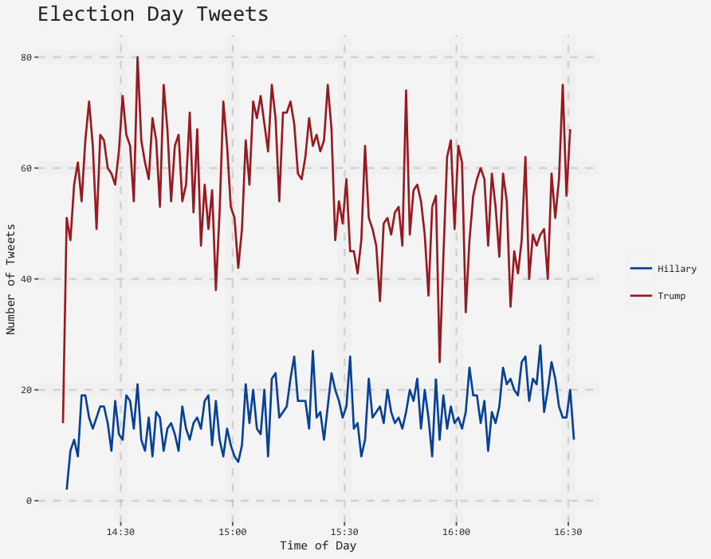

```{r, include = FALSE}
knitr::opts_chunk$set(comment = "#>", collapse = TRUE)
```

##

This vignette covers how to obtain and use Twitter API
access tokens for use in the `rtweet` package.

```{r, eval=FALSE}
# install from CRAN
install.packages("rtweet")

# load rtweet
library(rtweet)
```


```{r, eval=FALSE}
## read in previously streamed data
e <- readr::read_rds("eday.rds")

## convert to long-format aggregated time data
p <- e %>% ts_plot() %>%
    ggplot(aes(x = time, y = freq, color = filter)) +
    geom_line(size = 1.25)

## add rtweet-specific theme and labels
p %>%
    theme_rtweet(base_size = 10,
                 lighter = TRUE,
                 base_family = "Liberation Mono") +
    labs(title = "Election Day Tweets",
         x = "Time of Day",
         y = "Number of Tweets")
```


<p align="center">

</p>


