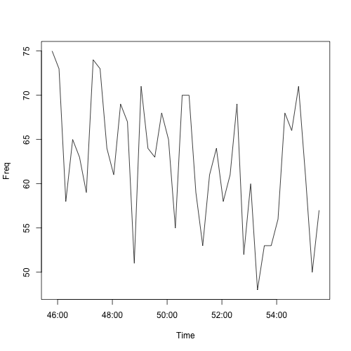

This vignettes provides a short time series analysis using the R package `rtweet: Collecting Twitter Data`.

## Accessing Twitter's API

Before you can start collecting data, you must first obtain a user access token.
To do this, I recommend following the vignette on [obtaining and setting up user access tokens](https://github.com/mkearney/rtweet/blob/master/vignettes/tokens.Rmd).
However, if you're in a hurry, the [quick guide found here](https://github.com/mkearney/rtweet/blob/master/README.md) works as well.

## Install and Load

```{r, eval=FALSE}
install.packages("devtools")
devtools::install_github("mkearney/rtweet")
library(rtweet)
```

## Stream tweets

```{r, eval=FALSE}
d <- stream_tweets(q = "debates2016", timeout = (60 * 10))
```

## Plot time series

```{r, eval=FALSE}
# plot time series
ts_plot(d, by = "15 secs")
```

<p align="center">

</p>